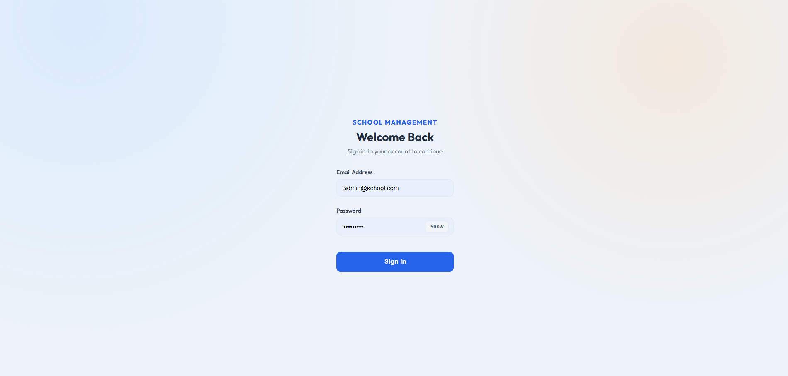
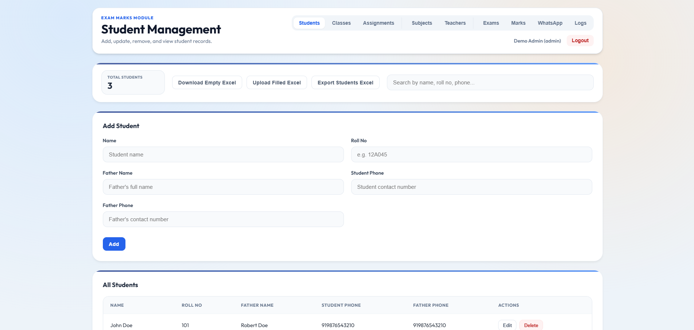
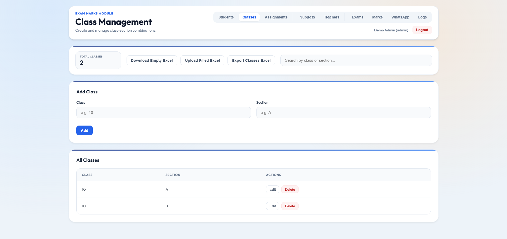
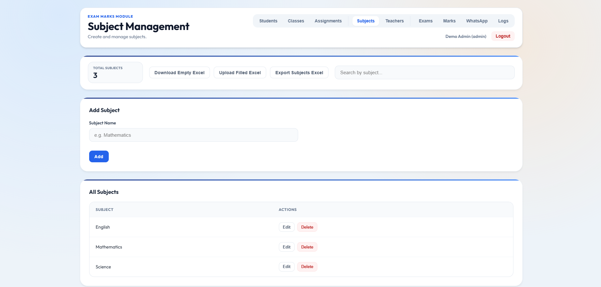
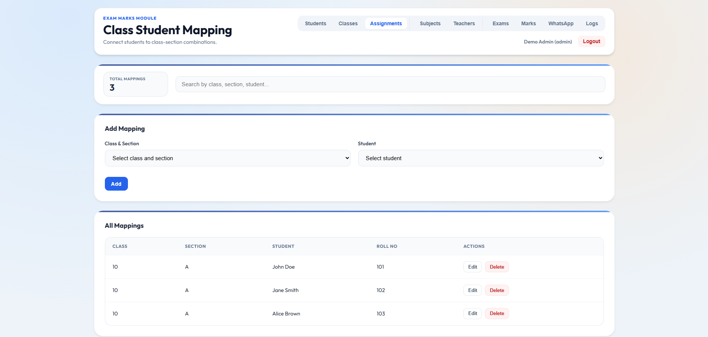
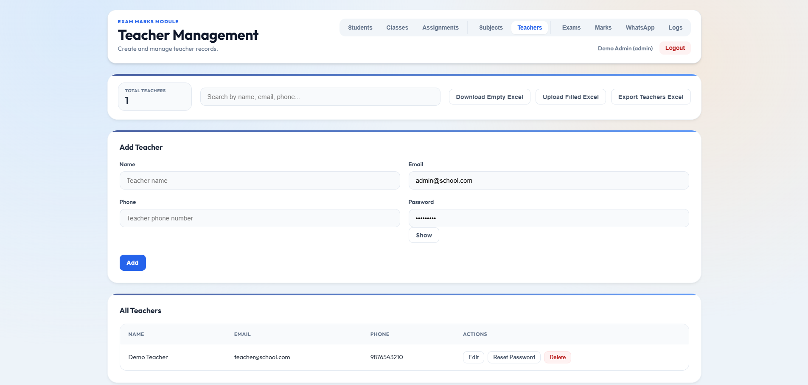
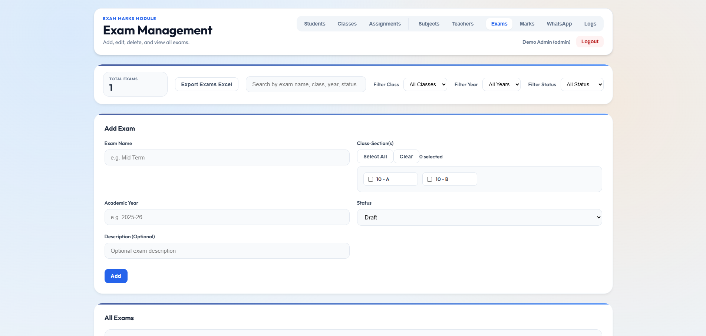

# Exam Marks & WhatsApp Notification System

**🚀 [Live Demo](https://exam-management.pages.dev/)**  
*(Login as **Admin:** `admin@school.com` / `Admin@123` or **Teacher:** `teacher@school.com` / `Teacher@123`)*

### 📝 Demo Credentials
*You can use these credentials to explore the [Live Demo](https://exam-management.pages.dev/):*

| Role | Email | Password |
| :--- | :--- | :--- |
| **Admin** | `admin@school.com` | `Admin@123` |
| **Teacher** | `teacher@school.com` | `Teacher@123` |

---

A comprehensive school management platform designed to streamline academic operations, automate student performance tracking, and facilitate seamless parent communication via the WhatsApp Cloud API.

---

## 📸 System Overview

### Secure Authentication & Access

*Modern, secure login interface supporting Role-Based Access Control (RBAC) for Admins and Teachers.*

### Student & Class Management

*Manage student profiles, including bulk Excel imports and advanced search filters.*


*Organize school structure by defining classes and sections with ease.*

### Academic Configuration

*Define core curriculum and subject lists.*


*Map students and subjects to specific class-sections to create a structured academic environment.*

### Faculty Management

*Manage teacher profiles and assign them to specific class-subject combinations.*

### Exam & Marks Operations

*Configure examinations, set schedules, and manage performance data with automated validation.*

---

## 🚀 Key Features

### 🛡️ Secure & Scalable Architecture
- **Multi-Tenant Design:** Data is logically scoped by `collegeId`, ensuring privacy and scalability for multiple institutions.
- **Robust Security:** Implements JWT with **Refresh Token rotation**, CSRF protection, and account lockout mechanisms.
- **API Hardening:** Protected by **Helmet**, Express Rate Limiter, and MongoDB query sanitization.

### 📱 WhatsApp Integration (Meta Cloud API)
- **Automated Results:** Send exam marks directly to parents' WhatsApp numbers.
- **Smart Safeguards:** Includes monthly sending caps, per-recipient delivery reporting, and phone number normalization.
- **Custom Notifications:** Add personalized notes to automated result messages.

### 📊 Data & Audit Management
- **Bulk Operations:** Seamlessly import/export Students, Teachers, and Marks using **Excel (XLSX)** templates.
- **Comprehensive Auditing:** Tracks all administrative actions and security events with CSV export for compliance.
- **Teacher Portal:** A restricted view for faculty to manage marks and notifications for their assigned classes only.

---

## 🛠️ Technical Stack

- **Frontend:** React 19, TypeScript, Vite, Vanilla CSS.
- **Backend:** Node.js, Express, MongoDB (Mongoose).
- **Communication:** Meta WhatsApp Cloud API.
- **Security:** JWT, CSRF, Helmet, Rate Limiting.

---

## ⚙️ Setup & Installation

### Prerequisites
- Node.js 18+ & npm
- MongoDB Atlas account
- Meta Developer account (for WhatsApp API)

### Installation
1. **Clone the repository**
2. **Install Dependencies**
   ```bash
   # Install Backend dependencies
   cd backend && npm install
   
   # Install Frontend dependencies
   cd ../frontend && npm install
   ```
3. **Configuration**
   - Copy `backend/.env.example` to `backend/.env` and fill in your MongoDB URI and WhatsApp API credentials.
   - *Note: Ensure your MongoDB Password is URL-encoded if it contains special characters.*

4. **Seed Demo Data** (Optional)
   ```bash
   cd backend
   node src/scripts/seedDemoUsers.js
   ```

5. **Start Development Servers**
   ```bash
   # Start Backend (Port 5000)
   cd backend && npm run dev
   
   # Start Frontend (Port 5173)
   cd frontend && npm run dev
   ```

---

## 💡 Notes
- **WhatsApp Test Mode:** In development, messages only go to numbers verified in your Meta App Dashboard.
- **Data Scoping:** All data is associated with a `collegeId` (defaults to 'default').

---
*Developed with focus on efficiency, security, and user experience.*
